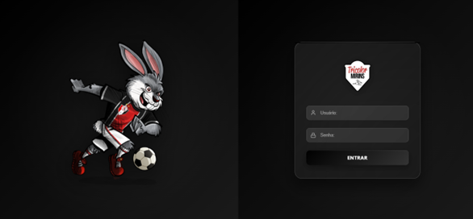
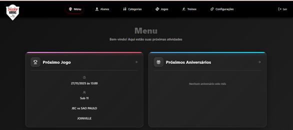
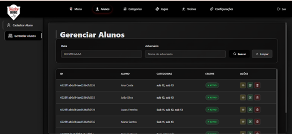
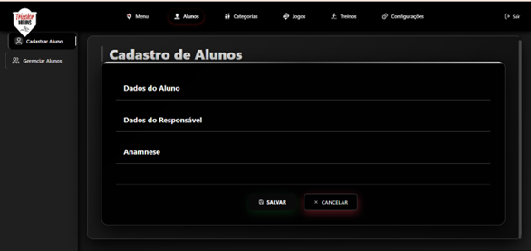
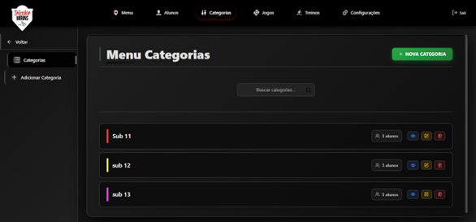
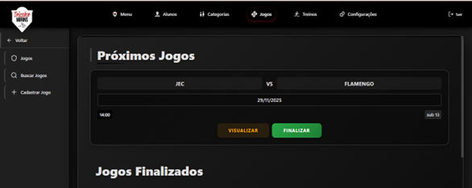
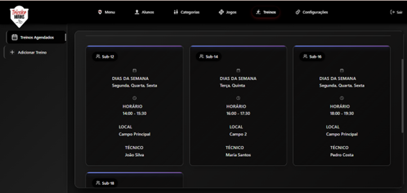
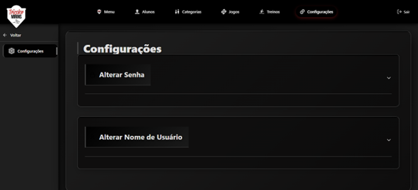

# Aplicação Web para Gestão de Atletas Tricolor Mirins

## PAC - Projeto de Aprendizagem Colaborativa Extensionista do Curso de Engenharia de Software da Católica de Santa Catarina

**Autores:** Dereck Conink e Pâmela Baron

**Professores orientadores**: Luiz Carlos Camargo e Claudinei Dias

---

## 1.Introdução
A justificativa para o desenvolvimento do projeto reside na necessidade de resolver problemas críticos gerados pela ausência de um sistema informatizado em ambientes esportivos, como falhas de comunicação, perda de dados e dificuldades no controle dos atletas. Em particular, a falta de acesso rápido a informações médicas em emergências comprometia a segurança e o atendimento imediato aos alunos. A solução proposta teve como objetivo desenvolver uma aplicação web para a gestão completa dos alunos , visando centralizar informações essenciais , reduzir a carga operacional e minimizar erros administrativos para os gestores. A entidade diretamente beneficiada pelas ações de extensão foi o Projeto Tricolor Mirins, localizado em Joinville.

---

## 1.2 Descrição da aplicação

A aplicação possui uma navegação que é facilitada por um menu superior fixo que dá acesso rápido às seções principais: Menu Inicial, Alunos, Categorias, Jogos, Treinos e Configurações.

Fluxo de Uso e Telas Principais:
- A entrada no sistema é controlada por uma Tela de Login com autenticação por senha, restrita a colaboradores e administradores.
- Após o login, o usuário é direcionado para uma tela inicial que serve como sistema de acesso rápido. Nela, são exibidos lembretes e informações resumidas, como o "Próximo Jogo" agendado (com data, hora e adversário) e os "Próximos Aniversários".
- A seção Gerenciamento de Alunos permite o controle completo dos cadastros, incluindo a visualização, edição, exclusão e busca dos alunos. A busca é otimizada com filtros por categoria, nome ou posição em campo.
- Na seção Cadastro de Alunos e Anamnese a tela de cadastro é segmentada para a inserção de Dados do Aluno, Dados do Responsável e o módulo de Anamnese, garantindo que informações vitais de segurança estejam sempre acessíveis.
- Nos itens de Gestão de Jogos e Treinos existem seções dedicadas para o Cadastro de Jogos incluindo escalação e registro de resultados, e para o Gerenciamento de Treinos. As telas de Treinos Agendados exibem a organização por categorias, com detalhes sobre dias da semana, horários, local e técnico responsável.
- A seção de configurações permite personalização do usuário, permitindo que o colaborador ou administrador altere suas informações de acesso. As funcionalidades desta tela incluem alterar senha e alterar o  nome de usuário

---

## 2. Descrição do Público Beneficiado pelas Ações de Extensão
O público beneficiado é composto por:  
- **Colaboradores e administradores:** maior controle administrativo e acesso rápido a informações.  
- **Atletas:** ambiente esportivo mais seguro e organizado.  

---

## 3. Objetivo
Desenvolver e implementar uma **aplicação web** promovendo:  
- Eficiência administrativa.  
- Segurança na tomada de decisões.  
- Acesso rápido a informações médicas e cadastrais.  

---

## 4. Descrição das Principais Atividades Realizadas

### 4.1 Definição da Proposta
Criação de um sistema que substitui métodos manuais de gestão de:  
- Dados de alunos.  
- Jogos.  
- Categorias.  
- Informações médicas.  

### 4.2 Estabelecimento dos Objetivos e Funcionalidades
Principais funcionalidades:  
- Login.  
- Gerenciamento de alunos (cadastro, edição, visualização, remoção).  
- Anamnese.  
- Cadastro de jogos, escalação e resultados.  
- Cadastro de categorias.
- Calendário de eventos (treinos, campeonatos, jogos).  
- Lembretes r acesso rápido no painel inicial.  
- Filtros de busca de alunos (categoria, nome, posição).  

### 4.3 Tecnologias Utilizadas
- **Frontend:** React, HTML, CSS, JavaScript.  
- **Backend:** Node.js com Express.  
- **Autenticação:** JWT (JSON Web Token).  
- **Versionamento:** GitHub.  
- **Gestão de Tarefas:** JIRA - [Acesse aqui](https://pbaron.atlassian.net/jira/software/projects/PACJEC/summary)
- **Prototipagem:** Figma.
- **Banco de Dados:** MongoDB Atlas.

---

## 5. Configuração do Ambiente e Inicialização
Para preparar o ambiente de desenvolvimento e executar a aplicação, definimos a utilização de arquivos .env para o gerenciamento de variáveis sensíveis, além da execução dos módulos Frontend e Backend separadamente.

Abaixo está o procedimento necessário para baixar as dependências e iniciar o projeto em um ambiente de desenvolvimento.

### 5.1 Instalação de Dependências
Tanto o módulo de Backend quanto o módulo de Frontend precisarão ter suas dependências baixadas individualmente.
 - No diretório do Backend abra o terminal e execute: npm install
 - No diretório do Frontend abra o terminal e execute: npm install

### 5.2 Inicialização dos Módulos
Após a instalação das dependências, os módulos devem ser iniciados em terminais separados para que a comunicação entre Frontend e Backend seja estabelecida.
- No terminal do diretório Backend, execute: npm start
- No terminal do diretório Frontend, execute: npm run dev

---

## 6. Telas Principais do Projeto

### Tela de Login e Acesso
Exibe a interface de autenticação do sistema, onde o usuário insere suas credenciais.

### Menu Inicial
É a tela principal após o login, projetada para acesso rápido às informações.

### Gerenciamento de Alunos
Tela central para a administração dos cadastros de atletas. Permite a busca rápida de alunos e exibe uma tabela com informações como nome, categoria, status e ícones de ação para cada perfil.

### Cadastro de Alunos
Formulário para inclusão de novos atletas. A interface está organizada em seções claras: Dados do Aluno, Dados do Responsável e Anamnese

### Menu de Categorias
Permite a gestão das categorias do projeto. Lista as categorias existentes e possui um botão destacado para adicionar uma "Nova Categoria".

### Próximos Jogos
Tela dedicada ao controle de partidas. Exibe os Próximos Jogos agendados, permitindo a visualização e edição dos detalhes, além de listar os Jogos Finalizados abaixo.

### Treinos Agendados
Apresenta a organização visual dos horários de treino por categoria. Mostra cards detalhando os treinos com Dias da Semana, Horário, Local e o nome do Técnico responsável.

### Configurações
Tela para que o usuário do sistema possa gerenciar suas credenciais de acesso. Oferece as opções de Alterar Senha e Alterar Nome de Usuário.

